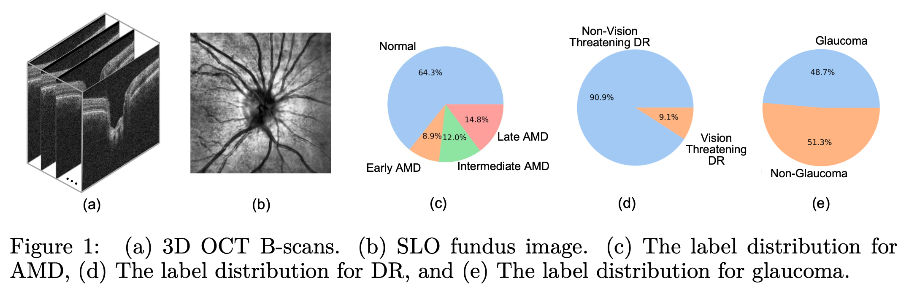

# Eye Fairness 30K

The dataset and code for the paper entitled *Eye Fairness: A Large-Scale 3D Imaging Dataset for Equitable Eye Diseases Screening and Fair Identity Scaling*. 

# Dataset

The dataset can be accessed via this [link](https://drive.google.com/drive/folders/1mx7g5hd7UYF7Ec5_hp8JGFv0p2VWCMT_?usp=sharing). This dataset can only be used for non-commercial research purposes. At no time, the dataset shall be used for clinical decisions or patient care. The data use license is [CC BY-NC-ND 4.0](https://creativecommons.org/licenses/by-nc-nd/4.0/).

Our dataset includes 10,000 subjects for Age-Related Macular Degeneration (AMD), Diabetic Retinopathy (DR), and glaucoma separately, totaling 30,000 subjects with comprehensive demographic identity attributes including age, gender, race, ethnicity, preferred language, and marital status. Each subject has one Scanning Laser Ophthalmoscopy (SLO) fundus photo and one sample of Optical Coherence Tomography (OCT) B-scans. The size of OCT B-scans is 200 x 200 x 200 in glaucoma, while the one of OCT B-scans. The size of OCT B-scans is 128 x 200 x 200 in AMD and DR. 

The dataset has an approximate size of 1 terabyte (TB). To streamline the download process, we have compressed the samples for each disease into three zip files: AMD.zip (225 GB), DR.zip (224 GB), and Glaucoma.zip (215 GB). Upon downloading and extracting these datasets, you will find the dataset structure as follows.

```
EyeFairness
├── AMD
│   ├── test
│   ├── train
│   └── val
├── amd_meta.csv
├── DR
│   ├── test
│   ├── train
│   └── val
├── dr_meta.csv
├── Glaucoma
│   ├── test
│   ├── train
│   └── val
└── glaucoma_meta.csv
```
The "train/val/test" directories contain two types of data: SLO fundus photos and NPZ files that store OCT B-scans, SLO fundus photos, and additional attributes. SLO fundus photos serve visual inspection purposes, while the copies in NPZ files eliminate the need for the dataloader to access any other files except the NPZ files. The naming convention for SLO fundus photos follows the format "slo_xxxxxxx.jpg," and for NPZ files, it is "data_xxxxxx.npz," where "xxxxxx" (e.g., 006691) represents a unique numeric ID.

NPZ files have the following keys. 

In the AMD disease, the NPZ files have
```
dr_subtype: AMD conditions - {'not.in.icd.table', 'no.amd.diagnosis', 'early.dry', 'intermediate.dry', 'advanced.atrophic.dry.with.subfoveal.involvement', 'advanced.atrophic.dry.without.subfoveal.involvement', 'wet.amd.active.choroidal.neovascularization', 'wet.amd.inactive.choroidal.neovascularization', 'wet.amd.inactive.scar'}
oct_bscans: images of OCT B-scans
slo_fundus: image of SLO fundus
race: 0 - Asian, 1 - Black, 2 - White
male: 0 - Female, 1 - Male
hispanic: 0 - Non-Hispanic, 1 - Hispanic
```
The condition would be converted into the label of AMD by the condition-disease mapping.
```
condition_disease_mapping = {'not.in.icd.table': 0.,
                        'no.amd.diagnosis': 0.,
                        'early.dry': 1.,
                        'intermediate.dry': 2.,
                        'advanced.atrophic.dry.with.subfoveal.involvement': 3.,
                        'advanced.atrophic.dry.without.subfoveal.involvement': 3.,
                        'wet.amd.active.choroidal.neovascularization': 3.,
                        'wet.amd.inactive.choroidal.neovascularization': 3.,
                        'wet.amd.inactive.scar': 3.}
```

In the DR disease, the NPZ files have
```
dr_subtype: DR conditions - {'not.in.icd.table', 'no.dr.diagnosis', 'mild.npdr', 'moderate.npdr', 'severe.npdr', 'pdr'}
oct_bscans: images of OCT B-scans
slo_fundus: image of SLO fundus
race: 0 - Asian, 1 - Black, 2 - White
male: 0 - Female, 1 - Male
hispanic: 0 - Non-Hispanic, 1 - Hispanic
```
The condition would be converted into the label of vision-threatening DR by the condition-disease mapping.
```
condition_disease_mapping = {'not.in.icd.table': 0.,
                    'no.dr.diagnosis': 0.,
                    'mild.npdr': 0.,
                    'moderate.npdr': 0.,
                    'severe.npdr': 1.,
                    'pdr': 1.}
```

In the glaucoma disease, the NPZ files have
```
glaucoma: the label of glaucoma disease, 0 - non-glaucoma, 1 - glaucoma
oct_bscans: images of OCT B-scans
slo_fundus: image of SLO fundus
race: 0 - Asian, 1 - Black, 2 - White
male: 0 - Female, 1 - Male
hispanic: 0 - Non-Hispanic, 1 - Hispanic
```

We put all the attributes associated with the 10,000 samples in a meta csv file for each disease, including race, gender, ethnicity, marital status, age, preferred language.


# Abstract

<p align="center">

</p>

Fairness or equity in machine learning is profoundly important for societal well-being, but limited public datasets hinder its progress, especially in the area of medicine. It is undeniable that fairness in medicine is one of the most important areas for fairness learning's applications. Currently, no large-scale public medical datasets with 3D imaging data for fairness learning are available, while 3D imaging data in modern clinics are standard tests for disease diagnosis. In addition, existing medical fairness datasets are actually repurposed datasets, and therefore they typically have limited demographic identity attributes with at most three identity attributes of age, gender, and race for fairness modeling. To address this gap, we introduce our Eye Fairness dataset with 30,000 subjects (EyeFairness-30k) covering three major eye diseases including age-related macular degeneration, diabetic retinopathy, and glaucoma affecting 380 million patients globally. Our EyeFairness dataset includes both 2D fundus photos and 3D optical coherence tomography scans with six demographic identity attributes including age, gender, race, ethnicity, preferred language, and marital status. We also propose a fair identity scaling (FIS) approach combining group and individual scaling together to improve model fairness. Our FIS approach is compared with various state-of-the-art fairness learning methods with superior performance in the racial, gender, and ethnicity fairness tasks with 2D and 3D imaging data, which demonstrate the utilities of our EyeFairness dataset for fairness learning. To facilitate fairness comparisons between different models, we propose performance-scaled disparity measures, which can be used to compare model fairness accounting for overall performance levels.

# Requirements

To install the prerequisites, run:

```
pip install - r requirements.txt
```

# Experiments

To run the experiments with the baseline models on the task of AMD detection, execute:

```
./scripts/train_amd_base.sh
```

To run the experiments with the proposed FIS on the task of AMD detection, execute:

```
./scripts/train_amd_fis.sh
```

To run the experiments with the baseline models on the task of DR detection, execute:

```
./scripts/train_dr_base.sh
```

To run the experiments with the proposed FIS on the task of DR detection, execute:

```
./scripts/train_dr_fis.sh
```

To run the experiments with the baseline models on the task of glaucoma detection, execute:

```
./scripts/train_glaucoma_base.sh
```

To run the experiments with the proposed FIS on the task of glaucoma detection, execute:

```
./scripts/train_glaucoma_fis.sh
```
